Website yang saya buat adalah sebuah aplikasi florist digital yang berfokus pada pengelolaan data bunga oleh admin. Melalui sistem ini, admin dapat mengatur berbagai jenis bunga yang tersedia, seperti menambahkan data bunga baru, mengedit data bunga, hingga menghapus data bunga yang sudah tidak digunakan. Sistem ini dirancang seperti manajemen katalog pada toko bunga, di mana seluruh proses dikontrol oleh admin. Aplikasi ini dikembangkan menggunakan Laravel dengan arsitektur MVC untuk memahami alur request-response, termasuk proses login admin yang menghubungkan data ke halaman dashboard dan profil. Selain itu, data bunga ditampilkan secara dinamis menggunakan Blade templating dengan tampilan yang lembut dan estetik sesuai dengan tema florist.

Namun, pada tahap ini aplikasi belum menggunakan database, sehingga setiap proses penambahan, pengeditan, maupun penghapusan data belum tersimpan secara permanen dan tidak menyebabkan perubahan data secara nyata.

### Screenshot Hasil Web:

#### 1. Halaman Login
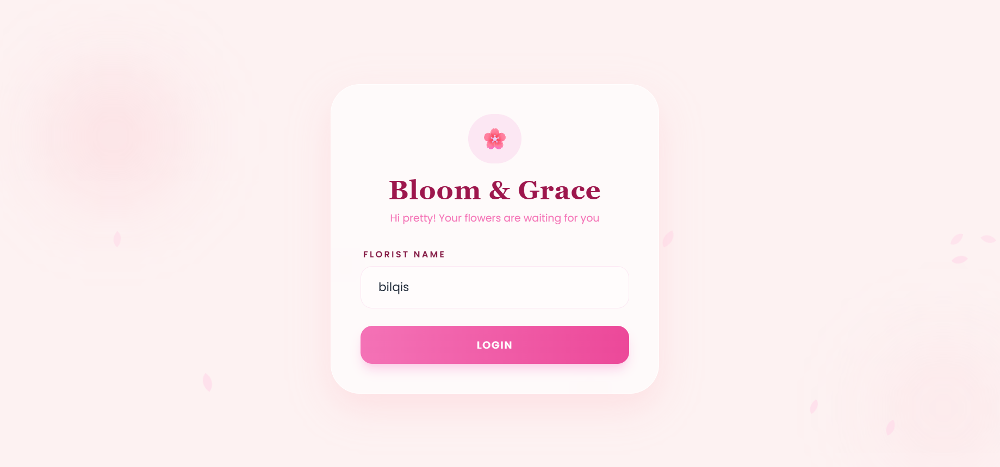

#### 2. Halaman Welcome
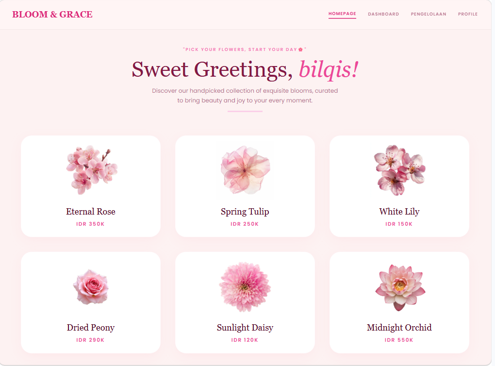
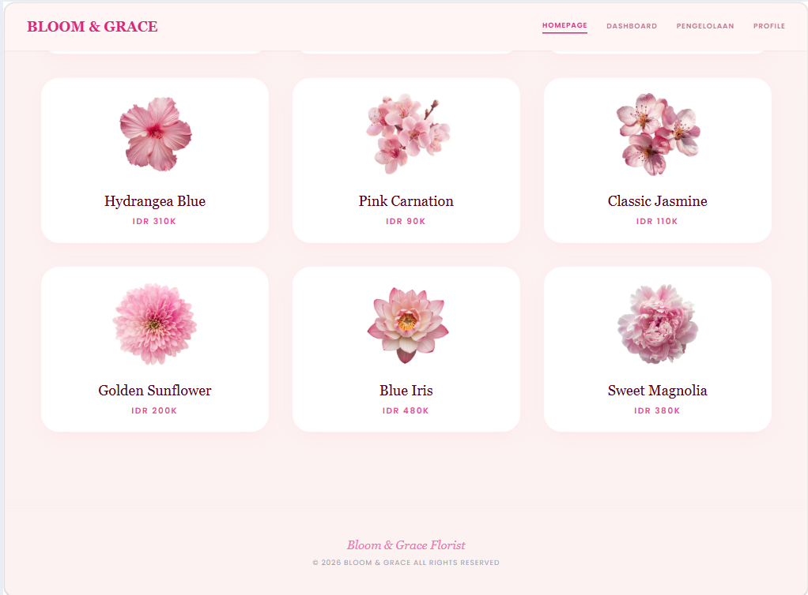

#### 3. Halaman Dahboard
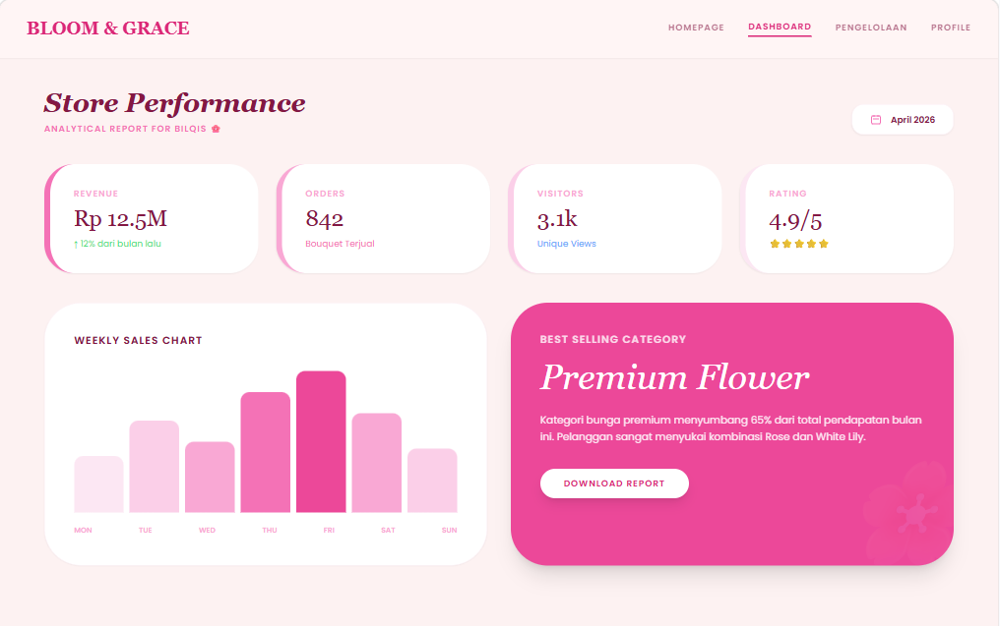

#### 4. Halaman Pengelolaan

#### 5. Filter Pengelolaan
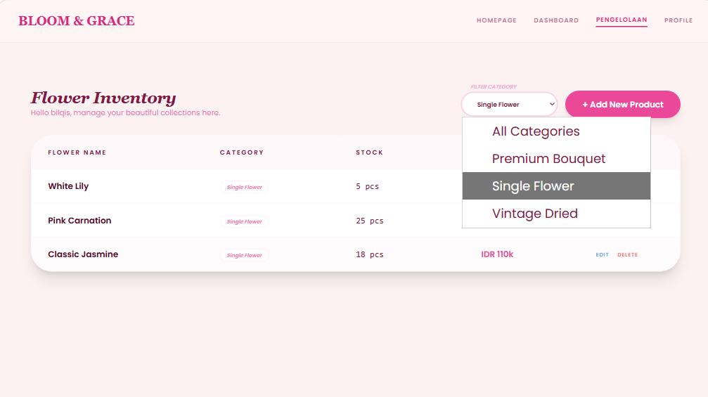

#### 6. Form Tambah
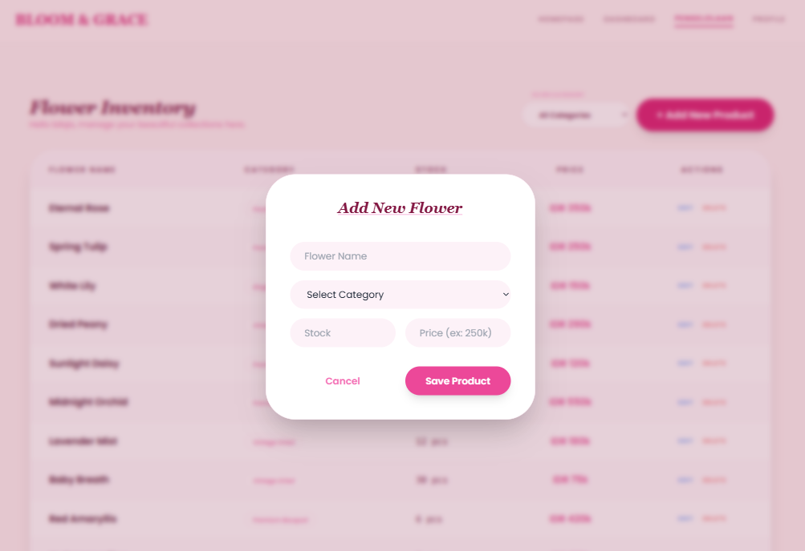

#### 7. Form Edit
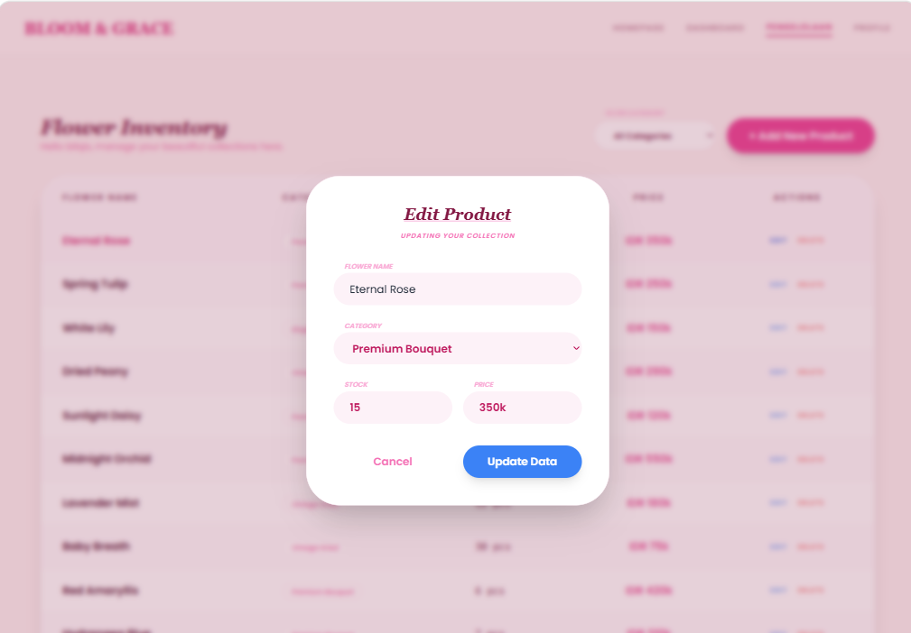

#### 8. Halaman Profile

#### RESPONSIVE MOBILE
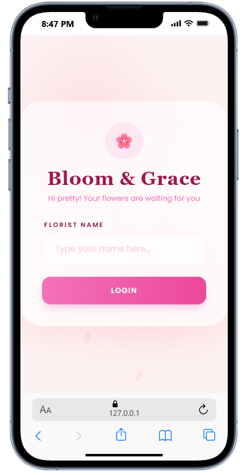
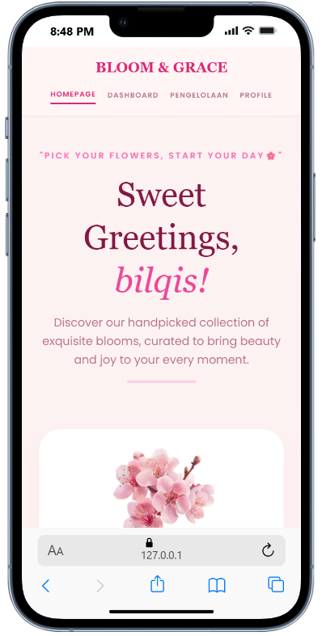
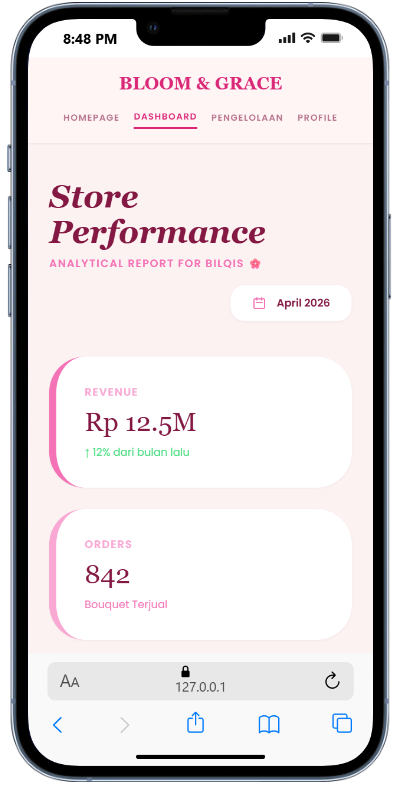
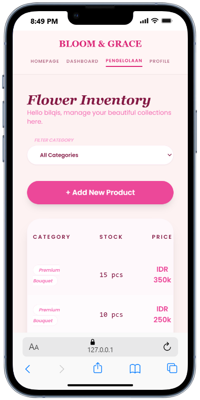
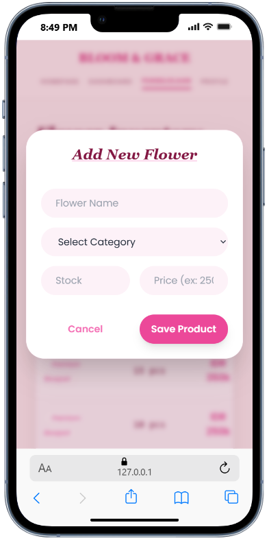
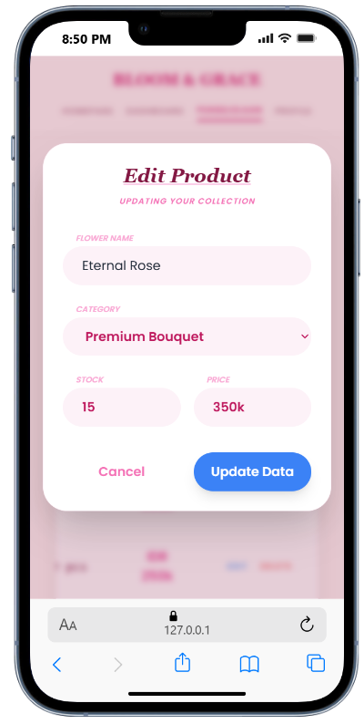
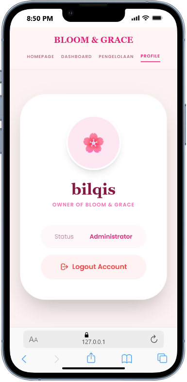